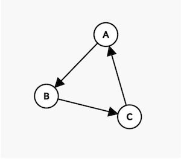
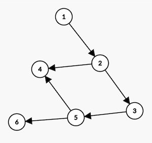
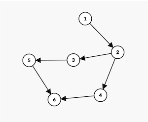

[Home](../README.md) | [Solution](./solution.py)

## Boot Order
<sup>Section: 1, Score: 12, Time limit per test: 30 seconds, Memory limit per test: 512MB, Input: stdin, Output: stdout</sup>

Agoda is developing a library called Bootable; this library is responsible for running tasks at the startup of a mobile application. Some tasks can be run by themselves while some tasks depend on the result of other tasks to run. Some tasks are more important than others. The importance of a task is determined by the level of priority assigned to it. 

The developer using this library is responsible for setting up the tasks that they require to boot their application and they also define the dependencies between tasks. However, the library is responsible for validating the list of tasks and their dependencies to make sure that the developer has set up these tasks correctly. 

The library first validates the tasks by making sure that there are no circular dependencies between tasks, for example if the developer has 3 tasks that are required to boot the application, tasks A, B and C with the following dependencies.  

Task A depends on Task B. 

Task B depends on Task C. 

Task C depends on Task A. 



For the above case, the validation should fail, because, before A runs, B must run and before C runs, A must run, so we are stuck in a loop.  

Only tasks with no dependency or all dependencies completed can be run. If there are multiple tasks that can be run, the task with the highest priority should be run first. 

Your task is to implement this library and make sure that when 

1. the configuration of the tasks is not correct, print -1 or,
2. the configuration is correct, print the execution order of the tasks. 

Note: The priority of the tasks is unique, so it is guaranteed that there will be only one correct order to run the tasks. The bigger the number, the higher the priority. 

### Input Format
The first line contains two integers M and N separated by a space.  

There are M tasks labelled from 1 to M, each task has a priority P which is equal to its label. There are N dependencies between the tasks. 

Each of the next N lines contains 2 space-separated integers x and y where x depends on y. 

### Constraints
$1 \le M \le 3\times 10^5$

$0 \le N \le \min(3\times 10^5, \frac{M(M-1)}{2})$
### Output Format
The list of tasks in the order that they should run, separated by space. If task validation fails, you should output -1. 

### Sample Input
```
6 6
1 2
2 3
2 4
3 5
5 6
5 4
```
### Sample Output
```
6 4 5 3 2 1
```
### Explanation
Tasks 4 and 6 do not have any dependencies. As task 6 has a higher priority, it will be executed first. However, once task 6 is completed, task 5 cannot be started as it is dependent on task 4 which has not yet finished. Therefore, the correct order of execution is `6, 4, 5, 3, 2, 1`.



### Sample Input
```
3 3
1 2
2 3
3 1
```
### Sample Output
```
-1
```
### Explanation
Task 1 depends on 2 and task 2 depends on 3, if task 1 tries to run, it first needs task 2 to run and 2 in turn needs 3 to run, but 3 depends on 1, so we are stuck in a loop. 

Validation failed because there is circular dependency between tasks, so we output -1. 


### Sample Input
```
6 6
1 2
2 3
2 4
3 5
4 6
5 6
```

### Sample Output
```
6 5 4 3 2 1
```

### Explanation
For this example, task 6 will run first since it is the only task that does not depend on any other tasks, after task 6 is successful, task 4 or task 5 are available to run but since task 5 has higher priority, it will run next, after task 5 is successful, task 3 and task 4 are available to run. Task 4 has higher priority so it runs next, after task 4 is successful only task 3 can run, then task 2 and then task 1. So, the output according to the sequence is  `6, 5, 4, 3, 2, 1`.

