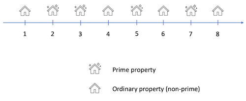

[Home](../README.md) | [Solution](./solution.py)

## Prime Properties

<sup>Section: 2, Score: 19, Time limit per test: 30 seconds, Memory limit per test: 512MB, Input: stdin, Output: stdout</sup>

Agoda hosts 2 million+ properties on its platform.  The best ones are called “prime property”, which provide a unique, comfortable stay to the guests and have a good customer rating.

In another parallel (mathematical) universe, all hotels are located on an infinite number line. And the prime properties are the ones located at prime coordinates. For example, a hotel at coordinate 3 is a prime property but another hotel at coordinate 10 is not.

Here is how it appears visually



Ms. Agoji is our regular customer. She is really into Prime properties and is staying in one of them right now. She has booked another prime property for tomorrow, but she is concerned whether she can get there or not, given she only travels prime distances, one at a time. She is OK with breaking her journey but only at other prime properties.

For example, if she needs to go from hotel 5 (prime) to hotel 3 (prime), she can directly go as she needs to travel 2 units (which is also a prime number).

However, if she needs to go from hotel 3 (prime) to hotel 7 (prime), she should first go to hotel 5 (prime) and then to hotel 7 (prime), each time travelling 2 units (which is also prime).

Given she is our loyal customer, please help her come up with the journey she should take to go from her current hotel to her next hotel tomorrow. If it is possible for her to reach her destination hotel, print the sequence of coordinates she needs to take. If it is not possible, display an apology message “Sorry Ms. Agoji!”.

### Input Format

One line containing $2$ integers $X$ and $Y$, separated by single space, where $X$ represents the coordinate of the current hotel Ms. Agoji is at, and $Y$ represents the hotel she needs to go to.

It is guaranteed that both $X$ and $Y$ are prime numbers.

### Constraints

$2 \le X, Y \le 10^{16}$

$X \ne Y$

$X + Y \le 10^{16}$

### Output Format

One line, containing the path Ms. Agoji can take to reach from hotel X to hotel Y. If there is more than one path, print the one with the least number of stops. If no such path exists, display the message “Sorry Ms. Agoji!”.

### Sample Input

```
5 3
```

### Sample Output

```
5 3
```

### Explanation

She can travel 2 units (which is prime) from hotel 5 to reach hotel 3.

### Sample Input

```
3 7
```

### Sample Output

```
3 5 7
```

### Explanation

She can first travel 2 units (which is prime) to reach hotel 5. From there, she can travel 2 units to reach hotel 7.
