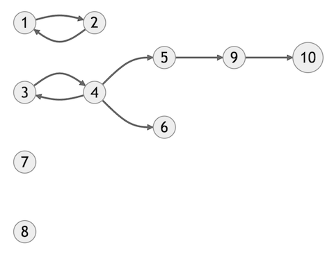
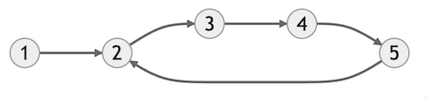

## 100 Under 40
<sup>Section: 3, Score: 33, Time limit per test: 30 seconds, Memory limit per test: 512MB, Input: stdin, Output: stdout</sup>

Nuy is a youthful adventurer with a passion for exploring a plethora of cities. With the ambitious goal of visiting 100 cities before turning 40, she is determined to make her dream a reality. However, her journey is complicated by a unique circumstance: the cities in her chosen wonderland are interconnected via one-way flights. Consequently, some cities may only have incoming flights, while others may only have outgoing flights. 

As a programmer, you have been tasked with assisting Nuy in determining the maximum number of cities she can visit on her journey, given that she starts her adventure in city $C$. 

### Input Format

The first line contains two integers $N$ and $M$, where $N$ is the number of cities and $M$ is the number of flights. 

The next $M$ lines contains two integers $u$ and $v$, where $u$ and $v$ are the cities connected by a flight from $u$ to $v$. 

The next line contains an integer $Q$, where $Q$ is the number of queries. 

The next $Q$ lines contains an integer $C$, where $C$ is the city Nuy starts her journey from. 

### Constraints

$1 \le N \le 10^5$

$1 \le M \le 2 \times 10^5$

$1 \le A, B \le N$

$1 \le Q \le 10^5$

$1 \le C \le N$

### Output Format

For each query print the maximum number of cities Nuy can visit in her journey if she starts from that city. 

### Sample Input

```
10 8
1 2
2 1
3 4
4 3
4 5
4 6
5 9
9 10
10
1
2
3
4
5
6
7
8
9
10
```

### Sample Output
```
2
2
5
5
3
1
1
1
2
1
```
### Explanation
The graph presented below corresponds to the sample test case provided.



In response to the third query, which asks how many cities can be reached from city 3, we have two options: we can either visit cities {3, 4, 5, 9, 10} or {3, 4, 6}. The first set of cities has a higher cardinality, with 5 cities that can be visited, and thus represents the result of the query. It is worth noting that if we choose to go to city 5, we cannot continue to city 6 as there is no direct or indirect flight between them. 
### Sample Input
```
5 5
1 2
2 3
3 4
4 5
5 2
2
1
2
```
### Sample Output
```
5
4
```
### Explanation
The flight connections between cities can be illustrated by the graph presented below. 



In the first query, Nuy can visit all the cities. 

In the second query, Nuy can visit cities 2, 3, 4, and 5. 
