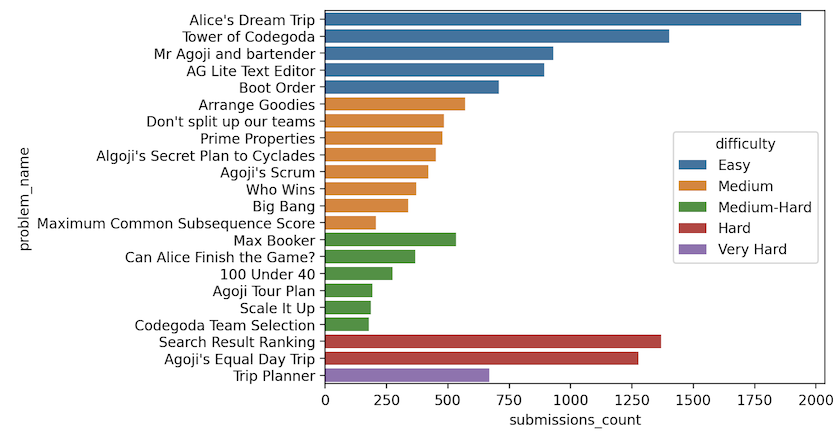
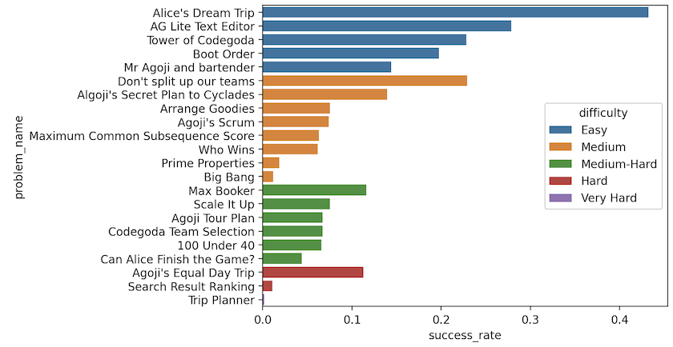

### Introduction

Codegoda-2023 concluded on April 1, 2023, featuring a total of 6 problems spread across 5 sections. The first three problems were chosen randomly from a set of similarly difficult problems, while the last three were identical for all participants. The sections increased in difficulty as the contest progressed.

Please refer to the table below for a summary of the problems in each section:

| Section | # Problem | Score | Difficulty  | Type                                                                 |
| ------- | --------- | ----- | ----------- | -------------------------------------------------------------------- |
| 1       | 5         | 12    | Easy        | Random: Each participant is randomly assigned a problem from the set |
| 2       | 8         | 19    | Medium      | Random: Each participant is randomly assigned a problem from the set |
| 3       | 5         | 33    | Medium-Hard | Random: Each participant is randomly assigned a problem from the set |
| 4       | 2         | 50    | Hard        | Fixed: Each participant is presented with both problems              |
| 5       | 1         | 76    | Very Hard   | Fixed: This problem is visible to every participant                  |

Please refer to the table below for a summary of the problems featured in the contest:

| #   | Problem                               | Section | Score | Difficulty  | Resources                                                                                                                                          |
| --- | ------------------------------------- | ------- | ----- | ----------- | -------------------------------------------------------------------------------------------------------------------------------------------------- |
| 1   | AG Lite Text Editor                   | 1       | 12    | Easy        | [Problem Statement](1-ag-lite-text-editor/problem-statement.md) \| [Solution](1-ag-lite-text-editor/solution.py)                                   |
| 2   | Alice's Dream Trip                    | 1       | 12    | Easy        | [Problem Statement](1-alices-dream-trip/problem-statement.md) \| [Solution](1-alices-dream-trip/solution.py)                                       |
| 3   | Boot Order                            | 1       | 12    | Easy        | [Problem Statement](1-boot-order/problem-statement.md) \| [Solution](1-boot-order/solution.py)                                                     |
| 4   | Mr Agoji and Bartender                | 1       | 12    | Easy        | [Problem Statement](1-mr-agoji-and-bartender/problem-statement.md) \| [Solution](1-mr-agoji-and-bartender/solution.py)                             |
| 5   | Tower of Codegoda                     | 1       | 12    | Easy        | [Problem Statement](1-tower-of-codegoda/problem-statement.md) \| [Solution](1-tower-of-codegoda/solution.py)                                       |
| 6   | Agoji's Scrum                         | 2       | 19    | Medium      | [Problem Statement](2-agojis-scrum/problem-statement.md) \| [Solution](2-agojis-scrum/solution.py)                                                 |
| 7   | Algoji's Secret Trip Plan to Cyclades | 2       | 19    | Medium      | [Problem Statement](2-algojis-secret-trip-plan-to-cyclades/problem-statement.md) \| [Solution](2-algojis-secret-trip-plan-to-cyclades/solution.py) |
| 8   | Arrange Goodies                       | 2       | 19    | Medium      | [Problem Statement](2-arrange-goodies/problem-statement.md) \| [Solution](2-arrange-goodies/solution.py)                                           |
| 9   | Big Bang                              | 2       | 19    | Medium      | [Problem Statement](2-big-bang/problem-statement.md) \| [Solution](2-big-bang/solution.py)                                                         |
| 10  | Don't Split Our Teams                 | 2       | 19    | Medium      | [Problem Statement](2-dont-split-our-teams/problem-statement.md) \| [Solution](2-dont-split-our-teams/solution.py)                                 |
| 11  | Maximum Common Subsequence Score      | 2       | 19    | Medium      | [Problem Statement](2-maximum-common-subsequence-score/problem-statement.md) \| [Solution](2-maximum-common-subsequence-score/solution.py)         |
| 12  | Prime Properties                      | 2       | 19    | Medium      | [Problem Statement](2-prime-properties/problem-statement.md) \| [Solution](2-prime-properties/solution.py)                                         |
| 13  | Who Wins                              | 2       | 19    | Medium      | [Problem Statement](2-who-wins/problem-statement.md) \| [Solution](2-who-wins/solution.py)                                                         |
| 14  | 100 Under 40                          | 3       | 33    | Medium-Hard | [Problem Statement](3-100-under-40/problem-statement.md) \| [Solution](3-100-under-40/solution.py)                                                 |
| 15  | 100 Under 40                          | 3       | 33    | Medium-Hard | [Problem Statement](3-agojis-tour-plan/problem-statement.md) \| [Solution](3-agojis-tour-plan/solution.py)                                         |
| 16  | Can Alice Finish The Game             | 3       | 33    | Medium-Hard | [Problem Statement](3-can-alice-finish-the-game/problem-statement.md) \| [Solution](3-can-alice-finish-the-game/solution.py)                       |
| 17  | Codegoda Team Selection               | 3       | 33    | Medium-Hard | [Problem Statement](3-codegoda-team-selection/problem-statement.md) \| [Solution](3-codegoda-team-selection/solution.py)                           |
| 18  | Max Booker                            | 3       | 33    | Medium-Hard | [Problem Statement](3-max-booker/problem-statement.md) \| [Solution](3-max-booker/solution.py)                                                     |
| 19  | Scale it up                           | 3       | 33    | Medium-Hard | [Problem Statement](3-scale-it-up/problem-statement.md) \| [Solution](3-scale-it-up/solution.py)                                                   |
| 20  | Agojis Equal Day Trip                 | 4       | 50    | Hard        | [Problem Statement](4-agojis-equal-day-trip/problem-statement.md) \| [Solution](4-agojis-equal-day-trip/solution.py)                               |
| 21  | Search Result Ranking                 | 4       | 50    | Hard        | [Problem Statement](4-search-result-ranking/problem-statement.md) \| [Solution](4-search-result-ranking/solution.py)                               |
| 22  | Trip Planner                          | 5       | 76    | Very Hard   | [Problem Statement](5-trip-planner/problem-statement.md) \| [Solution](5-trip-planner/solution.py)                                                 |

### Submission Statistics

The graphs below present a summary of the submission statistics for the problem. It is important to note that a solution is only considered accepted if it successfully passes all the test cases. The acceptance rate is calculated as the number of accepted submissions divided by the total number of submissions.

**Submission Counts**

**Acceptance Rate\/Succeess Rate**

### Difficulty Analysis
A clearer interpretation of the graph indicates that some problems in the medium section were either easy or difficult. The Prime Properties problem is not particularly challenging to solve, but there are several edge cases that make it challenging to get all the answers correct. On the other hand, the Big Bang solution is not difficult to implement, but it is challenging to prove that the solution is effective. The difficulty level for the other problems in the medium section was fairly consistent. The first two problems in this section were closer in difficulty to the easy section.

Moving to the medium-hard section, Max Booker was the easiest problem, followed by Scale It Up. However, it is important to note that our system detected a high degree of plagiarism in Scale It Up, and when this is taken into account, almost all the questions in the hard section had a similar success rate. The hardest problem in this section was Can Alice Finish the Game.

In the final three problems, which were the same for all contestants, one turned out to be less difficult because the test cases were weak. Given the success rate of the last two problems, they were indeed the most challenging problems in the competition.

It is worth mentioning that only one contestant was able to solve all the test cases for Trip Planner, the hardest problem in the contest.

**Submission Statistics in Tabular Form**
| Problem                          | Difficulty  | Section | Submissions | Accepted | Accepted % |
| :------------------------------- | :---------- | ------: | ----------: | -------: | ---------: |
| Trip Planner                     | Very Hard   |       5 |         668 |        1 |      0.14% |
| Agoji's Equal Day Trip           | Hard        |       4 |        1276 |      144 |     11.28% |
| Search Result Ranking            | Hard        |       4 |        1368 |       15 |      1.09% |
| 100 Under 40                     | Medium-Hard |       3 |         274 |       18 |      6.56% |
| Agoji Tour Plan                  | Medium-Hard |       3 |         193 |       13 |      6.73% |
| Can Alice Finish the Game?       | Medium-Hard |       3 |         366 |       16 |      4.37% |
| Codegoda Team Selection          | Medium-Hard |       3 |         179 |       12 |      6.70% |
| Max Booker                       | Medium-Hard |       3 |         533 |       62 |     11.63% |
| Scale It Up                      | Medium-Hard |       3 |         186 |       14 |      7.52% |
| Agoji's Scrum                    | Medium      |       2 |         420 |       31 |      7.38% |
| Algoji's Secret Plan to Cyclades | Medium      |       2 |         452 |       63 |     13.93% |
| Arrange Goodies                  | Medium      |       2 |         571 |       43 |      7.53% |
| Big Bang                         | Medium      |       2 |         338 |        4 |      1.18% |
| Don't split up our teams         | Medium      |       2 |         484 |      111 |     22.93% |
| Maximum Common Subsequence Score | Medium      |       2 |         206 |       13 |      6.31% |
| Prime Properties                 | Medium      |       2 |         478 |        9 |      1.88% |
| Who Wins                         | Medium      |       2 |         372 |       23 |      6.18% |
| AG Lite Text Editor              | Easy        |       1 |         893 |      249 |     27.88% |
| Alice's Dream Trip               | Easy        |       1 |        1940 |      839 |     43.24% |
| Boot Order                       | Easy        |       1 |         708 |      140 |     19.77% |
| Mr Agoji and bartender           | Easy        |       1 |         930 |      134 |     14.40% |
| Tower of Codegoda                | Easy        |       1 |        1401 |      320 |     22.84% |

Raw Data: [Codegoda 2023 - Submission](codegoda-submission.csv)

### Contribution

We welcome your contributions in any form, whether it be writing an analysis of the problem, providing an alternative solution with analysis, or sharing your ideas on how it can be improved. Please feel free to contribute in whichever way you see fit.
